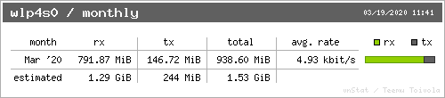

# Send Me My Internet Usage Statistics

Simple utility to send internet usage statistics using vnstat and vnstati linux utilities.

### Daily Stats

t

### Monthly Stats

# Install

    $ sudo apt install vnstat && sudo apt install vnstati

    $ echo 'export GMAIL_SMTP_ID="your-gmail-id"' >> ~/.<shell_rc_file>
    $ echo 'export GMAIL_SMTP_PASSWORD="your-gmail-passwrod" >> ~/.<shell_rc_file>
    $ echo 'export MY_EMAIL_ADDRESS='your-gmail-email' >> ~/.<shell_rc_file>

With pip3 installed

     $ pip3 install email-to

# Run script

    $ python daily.py && $ python monthly.py

# Schedule with Crontab

Add the following to crontab -e

    # at the top of crontab -e
    SHELL=<path-to-shell>
    PATH=/usr/local/sbin:/usr/local/bin:/sbin:/bin:/usr/sbin:/usr/bin

    # at the bottom of crontab -e

    # send daily internet usage stats at 11:59 PM every day
    59 23 * * * source ~/.<shell_rc_file> && python <path-to-daily.py>

    # send monthly internet usage stats at the last day of the month
    59 23 28-31 * * source ~/.<shell_rc_file> && python <path-to-monthly.py>
